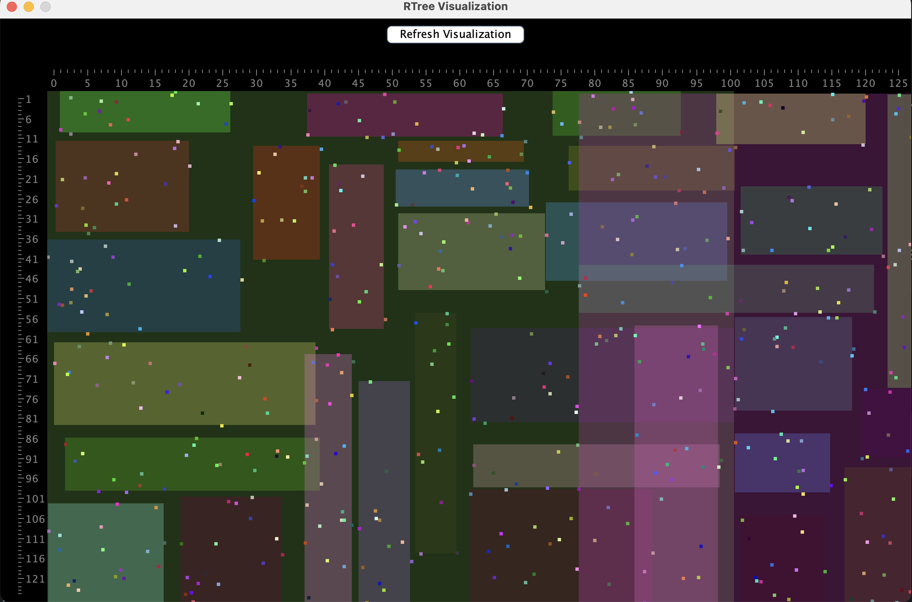

<h1 align="center">LinkedTree - Data Structures</h1>

<p align="center">
  <a href="https://www.java.com">
    
  </a>
  <a href="https://github.com/hexstorm9/AgeRoyale/tree/develop">
    
  </a>
    <a href="https://opensource.org/licenses/BSD-3-Clause">
    
  </a>
</p>

<p align="center">
LinkedTree is a Java project that implements a graph, a binary tree, an R tree and a Hash Table. It allows us to compare the performance of the different data structures, and to see which one is the most efficient for each case.
</p>


## Features
- [x] Graph with the ability to add and remove nodes and edges, and to search for the shortest path between two nodes.
- [x] Binary Tree with the ability to add and remove nodes, and to search for a node.
- [x] R Tree and visual representation, with the ability to add nodes, and to search for a node.
- [x] Optimized Hash Table, taking as reference the Java HashMap class.

## R Tree Visual Representation


## How To Use
```bash
# Clone this repository
$ git clone https://github.com/bielcarpi/LinkedTree.git

# Open the project on IntelliJ and Run it (tested with Java 17)
# On the main() there is a detailed explanation of how the program works, and what
#  attributes can be modified so as to modify its execution.
```

<br>

### Authors
Angel Garcia (angel.garcia@students.salle.url.edu)

Guillem Godoy (guillem.godoy@students.salle.url.edu)

Biel Carpi (biel.carpi@outlook.com)